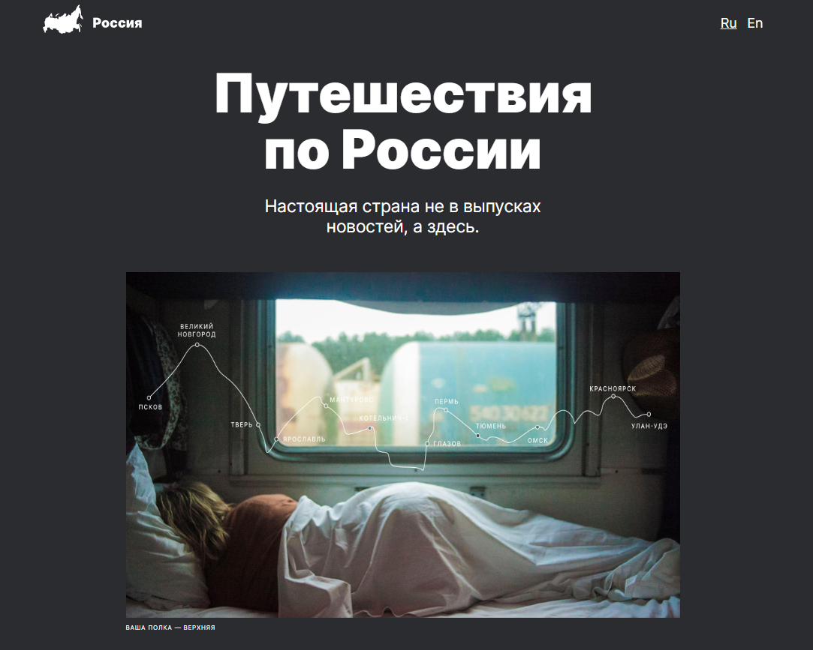

# Проект: Путешествие по России

<h2>Описание</h2>

В третьей проектной работе моим заданием было применить полученные знания в теории и сверстать адаптивный сайт.

<h2>Были применены такие технологии как</h2>
<ul>
  <li>HTML5</li>
  <li>CSS3</li>
  <li>Grid</li>
  <li>Flex</li>
  <li>Адаптивная вёрстка</li>
  <li>@Media</li>
</ul>

Изучена алаптивная вёрстка

Планы на дороботку

<ul>
  <li>подключить другие шрифты;</li>
  <li>проверить код на кроссбраузерность и дописать все вендорные префиксы;</li>
  <li>задизайнить форму, через которую пользователи смогут отправить вам комментарий.</li>
</ul>

